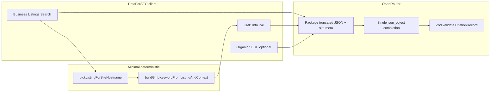

# Citation: OpenRouter extraction + compact UI (Research-aligned)

## OpenRouter only - no manual / regex fallback for citation fields

**Non-negotiable:**

- **CitationRecord population** (NAP, hours strings, GMB/social URLs, logos, description, keywords, discovered URLs) comes **only** from the OpenRouter `json_object` response validated by **zod**. No `buildCitationRecordFromDfs`, no `formatGmbHoursPerDay` for output, no regex-based phone/address/URL extraction as a fallback if OR fails or returns partial data.
- **If OpenRouter fails** (network, parse, zod): surface an error to the user and **do not** silently fall back to hand-rolled parsers. Optional: show empty fields after a single retry of the OR call only (still OR-only path).
- **Allowed without LLM** (not “citation extraction”): DataForSEO HTTP fetches; **pick listing row** for hostname match (`[pickListingForSiteHostname](src/lib/citation-research/dfs-business-listings-client.ts)` - domain/URL logic for *which API row to query*, not for filling citation text); **GMB keyword string** for the DFS request (`[buildGmbKeywordFromListingAndContext](src/lib/citation-research/citation-from-gmb-item.ts)`); optional **SERP fetch** that passes **raw** organic URL list into the OR prompt. If current `[citation-serp-social.ts](src/lib/citation-research/citation-serp-social.ts)` uses regex to classify social hosts, **remove or replace** with passing raw URLs to OpenRouter (no parallel regex extraction path).
- **Zod** is validation of model output, not extraction from DFS JSON.
- Aligns with `[.cursor/rules/agent-contract-openrouter.mdc](.cursor/rules/agent-contract-openrouter.mdc)`: no regex for branching/extraction of business facts; structured API + OpenRouter + typed validation.

## Context (current)

- `[CitationResearchTab.tsx](src/components/research/citation/CitationResearchTab.tsx)` (~494 lines): fetches Business Listings → picks listing by hostname → GMB live via `[fetchLocalStrategyGmbDfsRaw](src/lib/local-strategy-research/local-strategy-gmb-fetch.ts)` → `[buildCitationRecordFromDfs](src/lib/citation-research/citation-from-gmb-item.ts)` → SERP → `[generateCitationDescriptionWithOpenRouter](src/lib/citation-research/citation-description-openrouter.ts)` (description + keywords only).
- `[citation-from-gmb-item.ts](src/lib/citation-research/citation-from-gmb-item.ts)` (~508 lines): heavy manual mapping. **Replace** with OpenRouter structured extraction; **keep** DFS HTTP calls and hostname pick.
- UI: Citation uses some shared classes but the **results block** is a custom multi-section tile grid; other research tabs share a more predictable **toolbar + content** rhythm.

## Architecture after change

- **Keep**: `buildBusinessListingsTitleQuery`, `flattenBusinessListingItems`, `pickListingForSiteHostname`, `postBusinessListingsSearch`, `fetchLocalStrategyGmbDfsRaw`, and raw SERP fetch **or** a thin wrapper that returns organic URLs **without** regex-based field mapping (see OpenRouter-only section).
- **Remove entirely**: `buildCitationRecordFromDfs`, `buildCitationRecordFromListingOnly`, `formatGmbHoursPerDay` (or keep only if exported for unrelated callers - not used on citation generate path), and all DFS→string field helpers used only for manual citation extraction (**~350–400 lines** est. removed).

## 1. Single OpenRouter structured extraction

- **New module** (e.g. `[src/lib/citation-research/citation-extract-openrouter.ts](src/lib/citation-research/citation-extract-openrouter.ts)`, ~200–250 lines est.):  
  - **Input**: OpenRouter `apiKey`, `model`, `signal`, `site`, optional `seedKeyword`, raw `businessListingsJson`, `gmbLiveJson` (nullable), `pickedListing`, SERP URLs.
  - **Payload safety**: truncate/stringify bounded chunks of DFS JSON.
  - **Prompts**: Output one JSON object matching `[CitationRecord](src/lib/citation-research/citation-from-gmb-item.ts)`; **only** values evidenced in the provided JSON; `""` when absent; GMB/Maps URLs only if in source.
  - **Implementation**: `[callOpenRouterChatCompletion](src/lib/competitor-research/competitor-report-openrouter.ts)` + `json_object` + **zod** parse.
- **Delete** `[citation-description-openrouter.ts](src/lib/citation-research/citation-description-openrouter.ts)` (~62 lines) - absorbed into the new extractor.

## 2. Wire `CitationResearchTab` `runGenerate`

- After BL + GMB + SERP fetches, call **only** the new extractor (no `buildCitationRecordFromDfs`).
- Order: fetch data → build prompt package → OR → `setRecord`.

## 3. Slim `citation-from-gmb-item.ts`

- **Keep** (~80–120 lines est.): `CitationRecord` type, `buildBusinessListingsTitleQuery`, `buildGmbKeywordFromListingAndContext`.
- **Remove**: manual `buildCitationRecord*` and helpers not needed elsewhere.

## 4. Tests

- Update `[citation-research.test.ts](src/lib/citation-research/__tests__/citation-research.test.ts)`: keep `pickListingForSiteHostname` tests; add mocked OpenRouter extraction test; remove obsolete `buildCitationRecordFromDfs` test if deleted.

## 5. Compact UI + thematic consistency with other Research tabs

**Goal:** Citation should feel like **Competitor / Local strategy / Proposal / Reporting** - same visual language, not a one-off “profile dashboard.”

**Reference patterns** (reuse, do not reinvent):

| Pattern                                    | Source                                                                                                                                                  |
| ------------------------------------------ | ------------------------------------------------------------------------------------------------------------------------------------------------------- |
| Toolbar button sizing and semantic borders | `[REPORTING_TOOLBAR_BTN](src/components/research/reporting/reporting-toolbar-styles.ts)`, `REPORTING_TOOLBAR_BTN_DATA`, `REPORTING_TOOLBAR_BTN_PUBLISH` |
| Site switcher                              | `[ManagerConnectedSiteHeader](src/components/manager/ManagerConnectedSiteHeader.tsx)` `variant="compact"` (already on Citation)                         |
| Top control card shell                     | `rounded-xl border border-border/60 bg-card/40 p-4` (same as current Citation header card - keep)                                                       |
| Primary actions                            | `h-9` toolbar row: Generate = publish accent, secondary = data accent; `Sparkles` / `Loader2` parity with other tabs                                    |
| Icon accent                                | `text-[hsl(var(--semantic-data))]` for the tab icon (BookMarked), consistent with other research headers                                                |

**Results area (compact):**

- **No** large uppercase micro-labels (`PHONE`, `CITATION PROFILE`) or oversized per-field stat boxes that other tabs do not use.
- **Single** secondary content card (`border-border/50 bg-black/20` or match Local/Competitor result panels) with **dense** rows: `Input` / `Textarea` **readOnly** with `**placeholder**` for field meaning (e.g. placeholder `Phone`, `Address`) - labels only as placeholders + `aria-label` for a11y, **not** visible duplicate labels.
- Tight vertical rhythm: `gap-1.5`–`gap-2`, `text-sm`/`text-base` consistent with reporting inputs elsewhere.
- One **Copy** action using the same `REPORTING_TOOLBAR_BTN_DATA` treatment as today.

**Files:** primarily `[CitationResearchTab.tsx](src/components/research/citation/CitationResearchTab.tsx)` (~494 → ~220–280 lines est.); drop `CitationProfileStat` / `CitationSocialChip` as separate heavy components if replaced by shared-styled inputs.

## Risks and mitigations

| Risk                 | Mitigation                                                                                                                |
| -------------------- | ------------------------------------------------------------------------------------------------------------------------- |
| Model invents NAP    | Strict prompt + zod + empty if not in JSON                                                                                |
| Prompt too large     | Truncate DFS branches                                                                                                     |
| GMB empty            | OR still receives Business Listings + site URL                                                                            |
| OR timeout / failure | User-visible error; **no** fallback parser (optional single OR retry only)                                                |
| Regex creep          | Code review: citation tab must not import removed parsers or `mergeSerpSocialIntoCitation` if it encodes regex extraction |

## Files to touch (line counts approximate)

| File                                                                                                 | Current | After (est.) |
| ---------------------------------------------------------------------------------------------------- | ------- | ------------ |
| `[citation-from-gmb-item.ts](src/lib/citation-research/citation-from-gmb-item.ts)`                   | ~508    | ~80–120      |
| `[citation-description-openrouter.ts](src/lib/citation-research/citation-description-openrouter.ts)` | ~62     | 0 (delete)   |
| New `citation-extract-openrouter.ts`                                                                 | 0       | ~200–250     |
| `[CitationResearchTab.tsx](src/components/research/citation/CitationResearchTab.tsx)`                | ~494    | ~220–280     |
| `[citation-research.test.ts](src/lib/citation-research/__tests__/citation-research.test.ts)`         | ~40     | ~80–120      |

No new global CSS; theme tokens and shared research classes only.