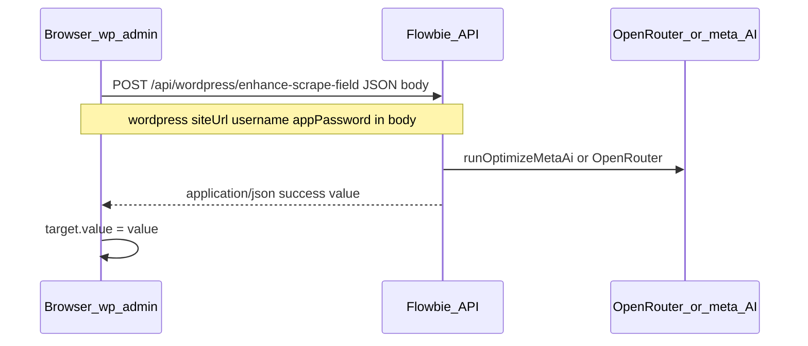

# Direct Flowbie calls for scrape wands

## Problem

`[admin-scrape-enhance.js](wordpress-plugins/flowbie-wp/assets/admin-scrape-enhance.js)` still hits WordPress (`admin-ajax.php`). Some hosts return **HTML** (plugins, output before JSON, security layers), so `[parseWpRestResponse](wordpress-plugins/flowbie-wp/assets/admin-scrape-enhance.js)` throws the “HTML instead of JSON” message.

Calling **Flowbie** from the browser skips WordPress entirely for the enhance request.

## Blocker: CORS

`[server/server.js](server/server.js)` applies global `cors()` with a **fixed allowlist** (Flowbie app, localhost). A wp-admin page on `https://neodigital.ca` sends `Origin: https://neodigital.ca`, which is **not** allowed, so the browser blocks the response before JS can read JSON - even if the server would return 200.

## Approach

1. **PHP** (`[trait-admin-wp-shell.php](wordpress-plugins/flowbie-wp/includes/admin/trait-admin-wp-shell.php)`): When `[Flowbie_Wp_Api::build_auth_payload()](wordpress-plugins/flowbie-wp/includes/class-flowbie-wp-api.php)` succeeds, localize:
  - `directEnhanceUrl`: `untrailingslashit(api_base) + '/api/wordpress/enhance-scrape-field'`
  - `wordpress`: `{ siteUrl, username, appPassword }` (same shape as `[enhance_field_run](wordpress-plugins/flowbie-wp/includes/class-flowbie-wp-rest.php)`)
  - `useDirectFlowbie`: `true` only when credentials + base are complete (otherwise wands keep trying admin-ajax or show a clear “configure Flowbie API” message)
2. **JS** (`[admin-scrape-enhance.js](wordpress-plugins/flowbie-wp/assets/admin-scrape-enhance.js)`):
  - If `useDirectFlowbie` and `directEnhanceUrl` + `wordpress`: `fetch(directEnhanceUrl, { method: 'POST', headers: { 'Content-Type': 'application/json' }, body: JSON.stringify({ field, currentValue, url, wordpress, context }) })` with `credentials: 'omit'`.
  - **Permalink `url**`: use the scrape **Page URL** field value for the loaded post (same as PHP `get_permalink($post_id)` when it matches the form); read `#flowbie_scrape_url_{suffix}` so `page_url` wand and others stay consistent.
  - Parse JSON `{ success, value }` (Node already returns this). On success, set `target.value` and dispatch events (existing behavior).
  - **Fallback**: If direct fetch fails (network, non-JSON), optionally retry **admin-ajax** once for sites that prefer proxy - optional to reduce complexity; can be “direct only” when configured.
3. **Server** (`[server/server.js](server/server.js)`): Allow browser origins for WordPress API routes only:
  - **Before** the current global `app.use(cors({...}))`, add `app.use('/api/wordpress', cors({ origin: true, credentials: false, methods: [...], allowedHeaders: ['Content-Type', 'Authorization', 'X-OpenRouter-Api-Key', ...] }))`.
  - **Adjust** the existing global CORS so it does **not** run a second restrictive pass on `/api/wordpress/*` (either mount WordPress permissive CORS first and skip global for that prefix, or merge logic in one `origin` callback that allows allowlist **or** path `startsWith('/api/wordpress')`). Goal: preflight from `https://any-customer-site.com` succeeds for `POST /api/wordpress/*`.
4. **Security / product**
  - Application Password in localized script is **only output to logged-in admins** on Flowbie WP screens - same trust model as saving credentials in wp_options; document that XSS on wp-admin remains a risk.
  - Optional filter `flowbie_wp_localize_direct_enhance` (bool) to disable direct mode without removing credentials from DB.
5. **Remove misleading copy**: When direct mode is primary, the `rest_html_error` string is less relevant; keep it only as fallback for admin-ajax path or retitle to a generic “response was not JSON”.

## Files to touch

| Area              | File                                                                                                                                           |
| ----------------- | ---------------------------------------------------------------------------------------------------------------------------------------------- |
| Localize + guard  | `[wordpress-plugins/flowbie-wp/includes/admin/trait-admin-wp-shell.php](wordpress-plugins/flowbie-wp/includes/admin/trait-admin-wp-shell.php)` |
| Fetch + field URL | `[wordpress-plugins/flowbie-wp/assets/admin-scrape-enhance.js](wordpress-plugins/flowbie-wp/assets/admin-scrape-enhance.js)`                   |
| CORS              | `[server/server.js](server/server.js)`                                                                                                         |

PHP `[ajax_enhance_field](wordpress-plugins/flowbie-wp/includes/class-flowbie-wp-rest.php)` / REST can remain for non-browser clients; no requirement to remove them.

## Deploy notes

- Deploy **Flowbie API** (CORS change) before or together with the plugin update, or direct calls will still fail on preflight.

