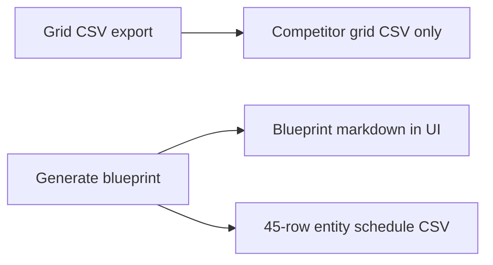

# Entity schedule CSV: 45 entities, 15/month, staggered times (3 months)

## Constraints (user)

- **No ZIP** - deliver the entity schedule as its **own CSV download** (separate from the blueprint `.md` file).
- **Not on Grid CSV** - **Grid CSV export** remains **competitor grid only**. The 45-row entity schedule is produced when the user **Generate blueprint** succeeds.
- **45 entities total** - **15 posts per month** for **3 months** (months 1–3 of the blueprint).
- **Optimized stagger times** - each row includes suggested scheduling metadata so posts are not clustered on one day/time (deterministic, spreadsheet-friendly).

## Output shape (recommended)

Single companion file: `local-strategy-entity-schedule-*.csv`

**Always exactly 45 data rows** (plus header), grouped by `Month` ∈ {1,2,3} with 15 rows each.

### Column set

Core scheduling (stagger):

- `Month` - 1, 2, or 3.
- `Post_In_Month` - 1–15 within that month.
- `Suggested_Publish_Date` - **placeholder** ISO date (`YYYY-MM-DD`) using a fixed rule: e.g. anchor “Month 1 = current month” is wrong for templates; better use **relative offsets**:
  - **Option A (template-first):** `Day_Offset_In_Month` (1–31) + `Time_Local` - user fills month/year in their CMS.
  - **Option B:** `Suggested_Publish_Date` = synthetic calendar starting **first Monday of a notional period** with 15 slots spread across **weekdays** (Mon–Fri) with non-overlapping times.

Recommended for clarity:

- `Week_Of_Month` - 1–5 (which week bucket for that post).
- `Weekday` - Mon … Fri (stagger across weekdays).
- `Suggested_Time` - local time string, staggered (e.g. rotate `09:00`, `10:30`, `14:00`, `11:00`, `15:30` across slots so same weekday doesn’t always get same time).

Entity fields (aligned with blueprint section 10 - [local-strategy-report-system-prompt.ts](src/lib/local-strategy-research/local-strategy-report-system-prompt.ts) case `10`):

- `Target_Entity_Type`
- `Example_Page_Slug`
- `Primary_Money_Page_Target`
- `Example_Query`
- `Notes` (optional)

**Seeding (optional):** pre-fill `Example_Query` (and light hints) from `seedTopKeywords` + `gscQueries` in round-robin order across the 45 rows; entity type hints (`neighborhood`, `landmark`, …) can rotate. Stagger columns remain **fully populated** regardless of seed availability.

### Stagger algorithm (deterministic)

- For each `Month` M ∈ {1,2,3} and `Post_In_Month` k ∈ 1..15:
  - Map k to a **weekday index** and **week of month** so 15 posts spread across **3–5 weeks** without stacking 15 posts in week 1 (e.g. 3 posts/week × 5 weeks = 15, or 5 posts/week × 3 weeks).
  - Assign `Suggested_Time` from a small rotating pool (5+ distinct times) to avoid “all 9am.”
- Do **not** require external APIs; all values computable in pure TS for tests.

## Integration

- New module [src/lib/local-strategy-research/local-strategy-entity-schedule-csv.ts](src/lib/local-strategy-research/local-strategy-entity-schedule-csv.ts) (+ shared `escapeCsvCell` dedupe if needed).
- [LocalStrategyResearchTab.tsx](src/components/research/local/LocalStrategyResearchTab.tsx):
  - **`downloadGridCsv` (Grid CSV / Grid CSV export):** unchanged - **only** the existing competitor grid CSV.
  - **`generateReport` (Generate blueprint):** after `runLocalStrategyReportAgent` succeeds and markdown is stored, build the entity schedule CSV from the same context (`semrushData`, `tiers`, `gscQueries`, `geoLabel`, …) and **auto-download** `local-strategy-entity-schedule-{slug}-{timestamp}.csv` with a short delayed second `triggerDownloadCsv` so the browser does not block. **Copy** / **Download .md** stay as they are (user fetches markdown manually).
- Toast on blueprint success: mention the entity schedule CSV download; **no ZIP**.

## Tests

- Row count = 45; counts per month = 15 each.
- No duplicate `(Month, Post_In_Month)`; stagger columns non-empty.
- Escaping for commas in seeded queries.

## Out of scope

- ZIP bundling.
- Parsing entities from generated Markdown.
- User timezone selection (template uses neutral labels like `Suggested_Time` + weekday; docstring in UI optional).

