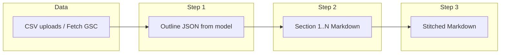

# GSC Reporting: Competitor-style process + section inventory table

## What’s wrong today

- [`ReportingTab.tsx`](src/components/research/reporting/ReportingTab.tsx) centers on a **two-column textarea** (raw vs generated). That does not match [`CompetitorResearchTab.tsx`](src/components/research/competitor/CompetitorResearchTab.tsx), which uses **toolbar exports**, **link-style downloads**, and a **per-section** list with `.md` and POST JSON.
- The GSC pipeline in [`gsc-reporting-pipeline.ts`](src/lib/gsc-reporting/gsc-reporting-pipeline.ts) already runs **outline JSON → N section calls → stitch**, but the UI does not show **which sections will be built** in a clear, scannable **table** - and not in the **GFM table style** the user wants (see reference below).

## Reference: desired table look

The user’s reference ([Untitled document.md](file:///c:/Users/Sean%20Craig/Downloads/Untitled%20document.md)) uses **GitHub-Flavored Markdown tables**: header row, `| :--- |` alignment, full-width readable columns - for example:

| Metric      | March 2026 | February 2026 | Change | % Change |
| ----------- | ---------- | ------------- | ------ | -------- |
| Impressions | 3978       | 3681          | 297    | 7.50%    |

**Reporting UI requirement:** the **section inventory** (the rows the pipeline will generate - one per `outline.sections[]` entry) must appear in a **table with the same visual language**: rendered via **ReactMarkdown** + **remarkGfm** (or an HTML `<table>` with matching borders/typography via existing `prose` / zone styles), inside a **flowbie-zone-tile** so it reads like those report blocks - not a bare HTML list.

### Full template: sections for an organic SEO report (canonical inventory)

This is the **complete section list** the product should target for a **GSC-led organic SEO report** - aligned with the user’s sample narrative (`Untitled document.md`) and standard monthly SEO deliverables. **H2 titles** below are templates: bracket tokens like `[current period]` / `[prior period]` are filled from the selected date range in copy.

| #   | Section ID                  | H2 title (report)                                         | Role              | Typical output (GFM tables where noted)                                            |
| --- | --------------------------- | --------------------------------------------------------- | ----------------- | ---------------------------------------------------------------------------------- |
| 1   | `executive_summary`         | Executive summary                                         | Opening narrative | Short prose; no table required (optional KPI strip)                                |
| 2   | `search_performance_period` | Search performance - [current period] vs [prior period]   | Period story      | Narrative + period headline metrics                                                |
| 3   | `key_performance_insights`  | Key performance insights for the team                     | Strategy          | Bullets tying themes to data                                                       |
| 4   | `sap_local_seo`             | Service area pages (SAP) and local SEO performance        | Local / URLs      | **Table:** page/URL, impressions, clicks, CTR, avg position                        |
| 5   | `growth_metrics`            | Growth metrics for [current period]                       | KPI board         | **Table:** metric, current period, prior period, change, % change                  |
| 6   | `all_search_terms_compare`  | All search terms: [current] vs [prior]                    | Query momentum    | **Table:** query, impressions (×2), change, % change (top N)                       |
| 7   | `new_search_discovery`      | New customer discovery: search terms you’re now found for | New queries       | **Table:** new term, impressions, clicks, avg position                             |
| 8   | `local_market_visibility`   | Local market visibility: reaching customers in your area  | Geo intent        | **Table:** local-oriented query, impressions, clicks, position                     |
| 9   | `content_performance`       | Content performance: your growing digital footprint       | Pages             | **Table:** page, impressions, clicks, avg position                                 |
| 10  | `top_opportunities`         | Top opportunities (max 45)                                | Prioritized wins  | **Table or list:** opportunity, why, metrics, evidence lines from CSV              |
| 11  | `cluster_*`                 | *[Topic cluster name from outline]*                       | Topic deep-dives  | One **section per cluster** (dynamic, cap e.g. 12); prose + optional small table   |
| 12  | `traffic_three_month`       | Estimated traffic potential (3 months)                    | Forecast          | **Table:** scenario / assumption / implied visits or range (contract from prompts) |
| 13  | `faq`                       | Frequently asked questions                                | Stakeholder Q&A   | **Table:** question, answer                                                        |

**Fixed vs dynamic:** Rows **1–10, 12–13** are **fixed** in intent (always planned). Row **11** repeats **once per topic cluster** from the outline (same idea as today’s `cluster-0…` rows).

**Gap vs current code:** Today [`gsc-reporting-outline.ts`](src/lib/gsc-reporting/gsc-reporting-outline.ts) only emits four **structural kinds** (`executive`, `opportunities`, `cluster`, `traffic_three_month`) and does **not** yet map to the **full 13-row template** above. **Implementation must:**

1. **Expand the outline JSON schema** and `GscReportingSectionKind` (or a string `sectionTemplateId`) so the outline step outputs **`sections[]` covering this full list**, with `ragQuery` per row and optional `skipIfEmpty` flags for SAP/pages if the CSV lacks URLs.
2. **Update section prompts** (`gsc-reporting-section-prompts.ts`) so each **kind** / template id produces the **table contracts** (columns) implied in the “Typical output” column - matching the GFM style in the user’s reference doc.
3. **UI inventory table** lists **exactly** `outline.sections` after generation - so once the outline matches this template, the on-screen table matches the screenshot the user expects (full organic report, not only four rows).

### Legacy reference: previous minimal outline (superseded by full template)

The earlier 4-row sketch (exec / opp / clusters / traffic) is **subsumed** by rows **1, 10–12** of the full template; the inventory UI must follow **`outline.sections`**, which after schema work should enumerate **all** rows in the table above.

After the outline model runs, **H2 titles** for dynamic rows (clusters, and any bracketed period labels) come from `outline` + date context; the table must **refresh** from live `outline.sections`.

## Target behavior

### Process (unchanged from prior plan)

### UI (updated)

1. **Toolbar** - same Competitor-aligned controls: Upload CSVs, Fetch GSC, Generate report, Copy/Download stitched Markdown, Add to KB.
2. **Section inventory table (new, required)** - As soon as **`outline`** exists (after outline step succeeds):
  - Build a **Markdown string** for a GFM table (or equivalent) with at least: **Order**, **ID**, **H2 title**, **Kind**, **RAG query** (truncated in cell, full text in `title` tooltip), **Status** (`Pending` / `Running` / `Done`).
  - Render with **ReactMarkdown** + **remarkGfm** inside `flowbie-zone-tile--analysis` (or `--data`), with **prose prose-invert** (or project-standard prose) so tables match the reference doc’s **bordered, readable** table look.
  - **Actions column:** small buttons or link-style controls for **Download .md** and **POST .json** per row when that section completes (same behavior as Competitor strategist rows).
3. **Outline JSON** - Separate compact panel: **Download outline (.json)**; optional scroll of pretty JSON.
4. **Raw CSVs** - Link list downloads per file (Competitor Semrush-style).
5. **No primary “generated report” `<Textarea>`** - Stitched output via Copy/Download; optional read-only **markdown preview** (not textarea).

### Pipeline / types

- `buildOpenRouterChatPostBodyJson` helper for per-section **POST .json** downloads.
- Extend `GscReportingPipelineResult` with `sectionResults`; optional `onSectionReady` for row status updates.
- Tests for result shape and stitch order.

### Outline schema + prompts (required for full template)

- **Expand** [`gsc-reporting-outline.ts`](src/lib/gsc-reporting/gsc-reporting-outline.ts) system prompt and validation so the model returns **`sections[]` that cover the full template table** (fixed rows + dynamic cluster rows), with stable `id` / `h2Title` / `kind` or `templateId` and `ragQuery` per row.
- **Extend** [`gsc-reporting-types.ts`](src/lib/gsc-reporting/gsc-reporting-types.ts) and [`gsc-reporting-section-prompts.ts`](src/lib/gsc-reporting/gsc-reporting-section-prompts.ts) so each section type emits **GFM tables** where the template specifies (metrics, SAP, queries, pages, FAQ) - not only the four legacy section kinds.

## Files to touch

- [`gsc-reporting-types.ts`](src/lib/gsc-reporting/gsc-reporting-types.ts), [`gsc-reporting-pipeline.ts`](src/lib/gsc-reporting/gsc-reporting-pipeline.ts), [`competitor-report-openrouter-limits.ts`](src/lib/competitor-research/competitor-report-openrouter-limits.ts) (or adjacent helper)
- [`ReportingTab.tsx`](src/components/research/reporting/ReportingTab.tsx) - **section inventory GFM table** + downloads; remove dual output textarea
- Tests under [`src/lib/gsc-reporting/__tests__/`](src/lib/gsc-reporting/__tests__/)

## Todos

- Expand **outline JSON + types** to emit the **full organic SEO section template** (table above): fixed rows + dynamic cluster rows; update validation and `defaultSectionsFromPayload` fallback.
- Update **section prompts** per template row (table contracts, GFM, period labels).
- Add `buildOpenRouterChatPostBodyJson` (or equivalent); use in GSC pipeline for `requestBodyJson` per section.
- Extend pipeline result + `runGscReportingPipeline` with `sectionResults` and optional `onSectionReady`.
- Refactor `ReportingTab`: **GFM inventory table** bound to `outline.sections`, per-row downloads, CSV links; remove generated textarea.
- Update/add gsc-reporting tests.

