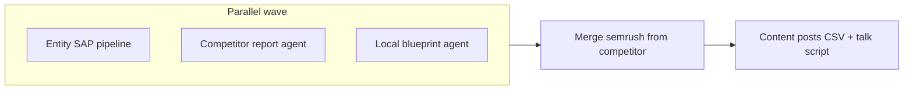

# End-to-end proposal parallelization (fast whole process)

## User intent

Not only **Entity SAP + competitor** in parallel, but **the whole pipeline** as fast as safely possible: overlap independent work so wall-clock is **sum of sequential tail** plus **one slow wave**, not a long chain.

## Dependency graph (what can overlap)

From [`ProposalResearchTab.tsx`](B:/USE%20THIS/Flowbie/src/components/research/proposal/ProposalResearchTab.tsx) and agents:

| Stage | Inputs | Produces |
|-------|--------|----------|
| `runLocalAnalysisEntitySapPipeline` | `srFiltered`, tiers, grid, GSC, etc. | SAP CSV rows |
| `runCompetitorReportAgent` | same `srFiltered` / `trFiltered` (read-only) | `competitorMd`, `keywordsMarkdown`, `semrushForReport` (clustered) |
| `runLocalStrategyReportAgent` | `semrush`, `tiers`, GBP, GSC ([`local-strategy-report-agent.ts`](B:/USE%20THIS/Flowbie/src/lib/local-strategy-research/local-strategy-report-agent.ts)) | `localMd` only |

**Local blueprint does not take competitor Markdown.** It builds its own wire from Semrush/tiers. So **competitor and local are independent** given the same `srFiltered` snapshot.

**SAP** does not use competitor or local Markdown.

Therefore **all three** can run in **one parallel wave**:

**Must stay sequential after the wave:**

- `buildProposalMatrixContentCsvRows` uses **`competitorMd`** ([`generateProposal` block](B:/USE%20THIS/Flowbie/src/components/research/proposal/ProposalResearchTab.tsx)).
- `runProposalTalkScript` needs **`combinedMarkdown`** (competitor + local + keywords).

So **tail** = posts CSV (sync) + talk script (OpenRouter) remains **after** the wave.

## Wall-clock impact (ideal)

- **Before:** `SAP + competitor + local + posts + talk`
- **After:** `max(SAP, competitor, local) + posts + talk`

OpenRouter and Wikipedia will be **highly concurrent**; expect **3x burst** vs today’s staggered usage.

## Implementation notes

1. **Start** `sapPromise`, `competitorPromise`, `localPromise` with identical inputs to today.
2. **`await Promise.all([...])`** (or `allSettled` + explicit throw policy per product).
3. **After all resolve:** `setSemrushData` merge from `semrushForReport`; `setLastSapScheduleRows`; then `buildCombinedProposalMarkdown` and existing tail.
4. **Early SAP UI:** optional `.then` on `sapPromise` to `setLastSapScheduleRows` when SAP finishes first.

## Progress UI (required)

Today `proposalSubphase` moves **sap → competitor → local** and `reportPipelineStep` is driven by **one** agent at a time. With three concurrent agents:

- **Option A:** `proposalSubphase === "report"` with **indeterminate** bar + label like `"Running competitor, local blueprint, and SAP…"`.
- **Option B:** **Weighted** progress, e.g. average of three normalized step ratios (needs each agent to report step/total or callbacks).
- **Option C:** **Namespaced** state: `competitorStep`, `localStep`, `sapDone` and a short multi-line status.

Pick one so the bar does not jump incorrectly or show only one pipeline while two others run.

## Cancellation

`activeWorkspaceKeyRef` checks must run **after** `Promise.all` and inside each branch; consider **AbortSignal** if agents support it (future).

## Rate limiting

Default **full parallel**; add optional **`MAX_PROPOSAL_PARALLEL_PIPELINES`** (e.g. 2) to run a **queue** or **(SAP+competitor) then local** if 429s appear in production.

## Out of scope unless requested

- Parallelizing **internal** steps inside each agent (e.g. more local sections) beyond existing parallel CS1–CS3.
- Changing **local** blueprint to consume **clustered** Semrush (would require ordering competitor before local).

## Supersedes

- Narrow plan only: **[SAP + competitor](c:/Users/Sean Craig/.cursor/plans/parallel_sap_and_competitor_12275d8e.plan.md)** (same repo may add a sibling file under `.cursor/plans/`).
