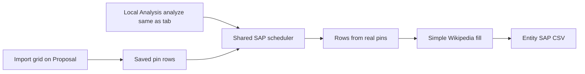

# Proposal uses Local Analysis on purpose, then builds the SAP sheet from the grid

## Plain English

1. **Use the Local Analysis plugin (Manager app).** The **Local Analysis** research tab is the real “local analysis” product surface: competitor pull, tiers, GSC, grid merge - implemented in `[LocalStrategyResearchTab.tsx](src/components/research/local/LocalStrategyResearchTab.tsx)`. **Proposal must call that same behavior** (shared code), running it **in the background** when the user generates a Proposal, so they do **not** have to switch tabs and click **Analyze** themselves.
2. **Use the grid you imported on Proposal.** After a grid CSV import, Proposal keeps the parsed pin rows in memory.
3. **Build entity SAP rows without inventing locations with a chat model for row text.** When those pin rows exist, Proposal builds each CSV row from **real grid pins + the competitor/tier context from Local Analysis** (see technical chain below). Wikipedia columns use the **simple website check**, not the AI-heavy lookup.

**Not the WordPress “Local analysis” panel:** `[LocalAnalysisPanel.tsx](src/components/sap-generator/LocalAnalysisPanel.tsx)` is a different screen (SAP generator inside the WP flow). This plan is about **Manager Local Analysis + Proposal**, not that panel.

## Technical chain (exact pipeline to preserve)

When the direct grid path is active, keep this sequence:

`gridSapParsedRows` → passed into the scheduler as `gridParsedRows` → `runLocalStrategySapSchedule` → `buildSapRowsFromGridDirect` → `enrichSapRowsWithWikipediaMediaWikiOnly` (when `builtFromGridDirect`).

In words: **saved grid pins → SAP scheduler → build rows from pins + local analysis data → fill Wikipedia without AI disambiguation.**

Code refs: `[local-strategy-sap-schedule-from-grid.ts](src/lib/local-strategy-research/local-strategy-sap-schedule-from-grid.ts)`, `[build-sap-rows-from-grid-direct.ts](src/lib/local-strategy-research/build-sap-rows-from-grid-direct.ts)`, `[enrich-sap-rows-wikipedia-mediawiki.ts](src/lib/wikipedia/enrich-sap-rows-wikipedia-mediawiki.ts)`.

## Micro steps (plain English)

**What the user does**

1. Open Proposal and set the site / seed like today.
2. Upload the Local Dominator grid CSV on Proposal.
3. Click generate Proposal (one button path - no “go to Local Analysis and Analyze first”).

**What the app should do, in order**

1. **Read the grid file** and keep a working copy of the pin rows (keywords, ranks, addresses) for later SAP rows.
2. **Run Local Analysis for real** - same competitor lookup, tiers, and related steps the Local Analysis tab runs when you hit Analyze - but **from Proposal**, in the background, with progress shown on Proposal (not by switching tabs).
3. **Build the entity SAP spreadsheet** using those pin rows plus the competitor/tier info from step 2 - real locations from the grid, not a chat model inventing rows.
4. **Fill Wikipedia columns** using the simple website check (no AI disambiguation for that step when this direct path is on).
5. **Continue the rest of the Proposal** (competitor write-up, blueprint, etc.) with the AI only where those sections need it.
6. **Optional polish:** only ask for the OpenRouter key when a step truly needs the AI; say so in the UI and in docs.

**What builders implement (maps to todos)**

- Pull the “Analyze” code into one shared module; Proposal and the Local Analysis tab both call it.
- At the start of “generate Proposal,” if analyze has not run or data is missing, **call that module automatically** before building SAP.
- Keep the existing pin → scheduler → build from grid → simple Wikipedia pipeline wired for Proposal.
- Update on-screen text so users know Local Analysis runs automatically.
- Add or keep tests for the above.

## Implementation focus

### 1. Silent “Local Analysis tab” inside Proposal

- **Today:** `[ProposalResearchTab](src/components/research/proposal/ProposalResearchTab.tsx)` and `[LocalStrategyResearchTab](src/components/research/local/LocalStrategyResearchTab.tsx)` each have their own `analyze()`; the user may need to run Analyze on Proposal before Generate, and behavior can diverge from the Local Analysis tab.
- **Target:** **Generate proposal** automatically runs the equivalent of Local Analysis `analyze()` (and grid-related merge steps that tab runs after grid upload) when needed - **no tab switch**. Show progress only in Proposal (micro-step / label), not by navigating to Local Analysis.
- **Mechanics:** Extract a shared function or module (e.g. `runLocalCompetitorAnalysisForResearch`) from both tabs’ `analyze` bodies. `generateProposal` **awaits** this before SAP + strategist sections when `semrushData` / `tiers` are missing or per a defined freshness rule.

### 2. Grid-direct SAP

- Same pipeline as **Micro steps** → “Build the entity SAP spreadsheet” and the **Technical chain** section above.

### 3. Key / UX

- Defer OpenRouter until LLM-only steps if ordering allows after auto-analyze + grid-direct SAP.

### 4. Copy

- Proposal: e.g. **“Local analysis runs automatically in the background.”**

### 5. Tests

- Orchestrator unit tests; existing `runLocalStrategySapSchedule` tests with `gridParsedRows`.

## Out of scope unless added later

- Refactoring `[LocalAnalysisPanel.tsx](src/components/sap-generator/LocalAnalysisPanel.tsx)` (WordPress SAP generator).

## Files that matter

- `[src/components/research/proposal/ProposalResearchTab.tsx](src/components/research/proposal/ProposalResearchTab.tsx)`
- `[src/components/research/local/LocalStrategyResearchTab.tsx](src/components/research/local/LocalStrategyResearchTab.tsx)`
- **New/shared:** local analysis runner extracted from both `analyze()` implementations
- `[src/lib/local-strategy-research/local-strategy-sap-schedule-from-grid.ts](src/lib/local-strategy-research/local-strategy-sap-schedule-from-grid.ts)`
- `[src/lib/local-strategy-research/build-sap-rows-from-grid-direct.ts](src/lib/local-strategy-research/build-sap-rows-from-grid-direct.ts)`
- `[src/lib/process-local-dominator-upload.ts](src/lib/process-local-dominator-upload.ts)`
- `[src/lib/wikipedia/enrich-sap-rows-wikipedia-mediawiki.ts](src/lib/wikipedia/enrich-sap-rows-wikipedia-mediawiki.ts)`

