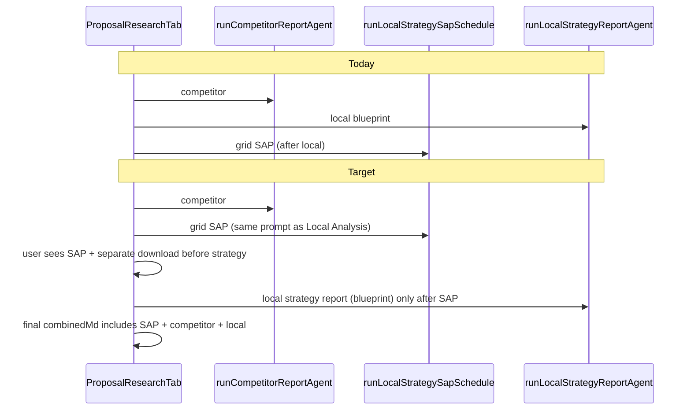

## Human checklist

1. **One shared flow** with Local Analysis for grid SAP - don’t maintain a second copy in Proposal.
2. **Temp seed** uses **seed** site name/URL and global wiki model; **connected** uses the selected site - same rules as Local Analysis.
3. **Wikipedia** on SAP rows the same way (back-entity columns).
4. SAP (and blogs) **before** the local strategy report; fold SAP story into the final markdown.
5. SAP **first** in the UI with its **own download**, then the blueprint.
6. Run TypeScript check and tests.

# Proposal: real Local Analysis SAP path + document in pipeline

## Root causes

1. **Extra prompt noise** - In [`runLocalStrategySapSchedule`](B:/USE THIS/Flowbie/src/lib/local-strategy-research/local-strategy-sap-schedule-from-grid.ts), `supplementalUserEvidenceMarkdown` is always set from [`buildLocalStrategyCompetitorGridSummaryMarkdown`](B:/USE THIS/Flowbie/src/lib/local-strategy-research/local-strategy-sap-schedule-from-grid.ts) (Labs competitor grid). [`LocalAnalysisPanel.runAnalysis`](B:/USE THIS/Flowbie/src/components/sap-generator/LocalAnalysisPanel.tsx) calls [`fetchLocalSeoStrategyFromGrid`](B:/USE THIS/Flowbie/src/lib/local-seo-strategy-from-grid.ts) **without** that field - so Proposal is **not** the same prompt as “Local analysis → Generate SAP rows”.
2. **Order** - [`generateProposal`](B:/USE THIS/Flowbie/src/components/research/proposal/ProposalResearchTab.tsx) runs `runLocalStrategyReportAgent` (local blueprint) **before** SAP. You want the SAP generator **before** the local report is produced.
3. **Dropped output** - `fetchLocalSeoStrategyFromGrid` returns `strategyMarkdown`, `keywordStrategyMarkdown`, and `questionsByKeyword`. `runLocalStrategySapSchedule` only returns `{ sapRows, usedFallback }`. [`buildCombinedProposalMarkdown`](B:/USE THIS/Flowbie/src/components/research/proposal/ProposalResearchTab.tsx) only includes competitor + local (+ optional keywords) - **no** SAP strategy text, so the “document” never shows the SAP generator output in the proposal package.

**Hard ordering (user requirement):** `runLocalStrategyReportAgent` (local SEO strategy / blueprint) **must not start** until grid SAP has finished, Wikipedia enrichment has run, and the user can **see** the SAP result. The “strategy report” in the product sense is the **11-section local blueprint** - SAP is always **before** that.

## Implementation

### 1. One shared “grid SAP” runner - no mirroring

**Do not** keep Proposal-only branches that duplicate Local Analysis behavior.

- Extract the **core** of [`LocalAnalysisPanel.runAnalysis`](B:/USE THIS/Flowbie/src/components/sap-generator/LocalAnalysisPanel.tsx) (the `fetchLocalSeoStrategyFromGrid` call and its inputs) into a **single** module under `src/lib/` (e.g. `local-analysis-grid-sap.ts` or similar) that both **LocalAnalysisPanel** and **ProposalResearchTab** import.
- That function should accept: grid markdown, keyword targets (from the same `buildLocalStrategySapKeywordTargetsFromGrid` / allocation as today), OpenRouter params, and **`siteName` / `siteUrl` / `siteId` / `entityLocation`** exactly as Local Analysis would use - **no** `supplementalUserEvidenceMarkdown` unless Local Analysis adds it (it does not for grid mode).
- **Refactor** `LocalAnalysisPanel` to call this helper so the Build tab and Research tab **never drift**.

### 2. Seed site vs connected site (same as Local Analysis intent)

When Proposal is in **Temp seed** (`neutralResearchWire`):

- Pass **`siteName` / `siteUrl`** from the **seed** (business name query + `effectiveSeedUrl`), not the connected WordPress site’s name/URL.
- Pass **`siteId: undefined`** for `fetchLocalSeoStrategyFromGrid` and for Wikipedia lookups so **global** research model + wiki behavior match “neutral” Local Analysis expectations.

When **Connected**:

- Pass the selected site’s `name`, `siteUrl`, `id` like Local Analysis does.

**Do not** use the connected site’s `id` for model/wiki when the user is in Temp seed.

### 3. Wikipedia / “back entities”

- Reuse the **same** enrichment path as Local Analysis (`lookupEntityHintWikipedia` / `enrichSapRowsWithWikipediaLookups` with the **same** `siteId` rules as above) so CSV rows get **`wikipedia_url` / `wikipedia_title`** without a second bespoke path.

### 4. Reorder Proposal `generateProposal` - SAP before local strategy report

In [`ProposalResearchTab.tsx`](B:/USE THIS/Flowbie/src/components/research/proposal/ProposalResearchTab.tsx):

**Sequence (strict):**

1. `runCompetitorReportAgent`
2. Validate grid
3. **Grid SAP** via the **shared runner** + Wikipedia enrichment
4. **Content blog CSV** (matrix) if needed
5. **`runLocalStrategyReportAgent`** only after 3–4
6. **Final** `combinedMd` includes competitor + SAP strategy sections + local

- **Progress** (`competitor` → `sap` → `local`) and labels updated accordingly.

### 5. Show SAP first + separate download

- SAP visible and **downloadable** (CSV + optional strategy `.md`) **before** blueprint finishes; full Proposal package still bundles everything at the end.

### 6. Tests

- Update mocks if the shared runner replaces direct `runLocalStrategySapSchedule` in Proposal.
- Run `tsc` and `vitest`.

## Out of scope

- **Deterministic** CSV-only rows with no `fetchLocalSeoStrategyFromGrid` - still use the real SAP generator.
