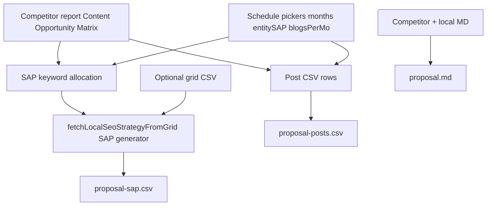

# Proposal export: matrix-driven blogs + SAP, picker counts, optional grid, three files

## Checklist (human-readable)

1. **Blog titles and blog keywords** come from the **competitor Content Opportunity Matrix** (What to Produce = title, Anchor Demand = keyword segments) - same idea as `[buildCompetitorBulkContentCsvRows](B:/USE THIS/Flowbie/src/lib/competitor-research/competitor-bulk-content-csv.ts)`. **No** fallback to Semrush or grid for **phrasing** when building those rows.
2. **Entity SAP page keywords** also come from that **same matrix** (Anchor Demand / matrix rows allocated for SAP) - not a separate grid-keyword pool. SAP **pages** are a **different** row set from blog posts; counts are **independent** and come only from the **number pickers** (months × entity SAP per month vs months × blogs per month).
3. **No fallbacks** for keyword/title sourcing: if the matrix cannot supply enough distinct rows for the **picker totals**, **fail loudly** (or show a clear error) - do **not** silently pad from Semrush/GSC or invent rows. **If/then:** an **optional** uploaded **grid CSV** may still be used for **local rank evidence / hints** inside the SAP **LLM** call, but it does **not** replace matrix keywords for blogs or SAP.
4. **Order:** **Blog posts first**, **SAP entity pages after** - in generation mindset and in **download order** (e.g. `proposal-posts-*.csv` then `proposal-sap-*.csv`) so “SAP comes after blog posts.”
5. **Three separate downloads** from one Proposal action: full **strategy Markdown** (report + Wikipedia validation section, no CSV embedded), **posts CSV**, **SAP CSV**. Copy = Markdown package only.

## Intent (revised - overrides prior “grid-only” plan)

| Piece            | Source of keywords / titles                                                                                                                                     | Count                                     |
| ---------------- | --------------------------------------------------------------------------------------------------------------------------------------------------------------- | ----------------------------------------- |
| Content blog CSV | **Competitor matrix** (M1–M3 / Anchor Demand / What to Produce)                                                                                                 | `months × contentBlogsPerMonth` (pickers) |
| Entity SAP CSV   | **Same competitor matrix** for **SAP keyword targets**; LLM fills entities/titles per SAP generator                                                             | `months × entitySapPerMonth` (pickers)    |
| Grid CSV upload  | **Optional** - **evidence** for `fetchLocalSeoStrategyFromGrid` (weak ranks, place hints) - **not** the keyword list for blogs or SAP when matrix is the contract | n/a                                       |

- **Strict:** Picker math is authoritative; **no** automatic fallback to Semrush keyword pools for proposal bulk rows when the user expects matrix-driven output.
- **Two CSVs** remain: one file for **posts**, one for **SAP** - different columns semantics (blogs vs service-area entities) but both matrix-anchored for **keyword/title inputs**.

## Current code (reference)

- Posts: `[buildCompetitorBulkContentCsvRows](B:/USE THIS/Flowbie/src/lib/competitor-research/competitor-bulk-content-csv.ts)` - already matrix-first; may fall back to Semrush phrases when matrix empty - **tighten for proposal:** matrix required or error.
- SAP: `[runLocalStrategySapSchedule](B:/USE THIS/Flowbie/src/lib/local-strategy-research/local-strategy-sap-schedule-from-grid.ts)` - can use grid, matrix, or Semrush; **tighten for proposal:** matrix keyword path for targets when competitor report present; grid only enriches prompts when present.
- Merge in `[ProposalResearchTab.tsx](B:/USE THIS/Flowbie/src/components/research/proposal/ProposalResearchTab.tsx)`: `[...sapRows, ...contentRows]` today - **flip to** `[...contentRows, ...sapRows]` if product wants blogs-first everywhere (downloads + any combined preview).

## Target behavior (diagram)

## Implementation notes (when executing)

1. **Proposal `generateProposal`:** Enforce `extractContentOpportunityMatrixRows(competitorMd).length > 0` (or equivalent) before building posts **and** SAP keyword targets; otherwise throw / notify with actionable message (no Semrush fallback for **proposal** bulk).
2. **Allocate matrix rows** to **two buckets:** first N_m = `months × blogsPerMonth` for `buildCompetitorBulkContentCsvRows`-style rows; next N_s = `months × entitySapPerMonth` for SAP keyword targets - **or** use distinct matrix-derived phrase lists so blog and SAP do not duplicate the same row if product requires - **clarify in implementation** if matrix row count < N_m + N_s (error vs repeat).
3. `**runLocalStrategySapSchedule`:** For proposal, prefer `**buildLocalStrategySapKeywordTargetsFromProposalMatrix**` when matrix present; pass `**gridSummaryMarkdown` / weights only as optional** supplemental context; do **not** branch to `buildLocalStrategySapKeywordTargetsFromGrid` **for keyword strings** when proposal policy is matrix-only (grid may still add evidence markdown).
4. **Downloads:** Implement `[buildProposalReportMarkdown](B:/USE THIS/Flowbie/src/lib/local-analysis-csv-export.ts)` (strategy + wiki only); sequential downloads: `.md` → posts CSV → SAP CSV with short delays; remove embedded CSV from any single MD package.
5. **Tests:** Matrix fixture + pickers → exact row counts; missing matrix → error path.

## Out of scope

- ZIP bundles.
- Using grid as **primary** keyword source for blogs or SAP (explicitly **not** this plan).

