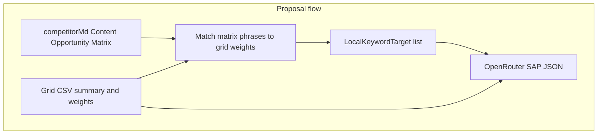

# Proposal SAP keywords from Content Opportunity Matrix + grid for entities

## User requirements (iteration)

- **Proposal** is the authority for **which keywords** appear in SAP - specifically the **Content Opportunity Matrix** (competitor strategist section: *What to Produce*, *Anchor Demand*, *Why*), not Semrush/GSC keyword pools.
- **Grid CSV** must inform **every decision about entities** (and geographic/strategy evidence): footprint, place hints, weakness patterns - not keyword discovery from competitors.
- Keywords should stay **succinct** (short Anchor Demand phrases / first segment rules, aligned with existing matrix parsing).

## Why this replaces the prior “blend with pool” idea

The earlier plan proposed blending **grid weights** with `**buildWeightedKeywordPoolForSap**` (Semrush + GSC). That conflicts with “keywords coming from anywhere but the proposal.” For **Proposal**, keyword variety must come from the **matrix rows** (typically 9 rows / M1–M3), not from enrichment pools.

## Source of truth in code

- **Matrix extraction** already exists: `[extractContentOpportunityMatrixRows](src/lib/competitor-research/competitor-report-keyword-extract.ts)`, `[extractAnchorDemandPhrasesFromContentOpportunityMatrixMarkdown](src/lib/competitor-research/competitor-report-keyword-extract.ts)`. Bulk content CSV uses the same matrix for blog rows: `[buildCompetitorBulkContentCsvRows](src/lib/competitor-research/competitor-bulk-content-csv.ts)`.
- **Proposal** already has `competitorMd` in scope before SAP: `[ProposalResearchTab.tsx](src/components/research/proposal/ProposalResearchTab.tsx)` (runs `runLocalStrategySapSchedule` after local markdown; `competitorMd` is available).

## Target behavior

### Keywords (Proposal SAP)

1. Parse `**competitorMd**` → matrix rows (`ContentOpportunityMatrixRow[]`).
2. Derive **one primary keyword string per matrix row** for SAP (succinct): prefer **first segment / first phrase** from **Anchor Demand** (same spirit as bulk CSV); if empty, derive from *What to Produce* only as a last resort (documented).
3. **Deduplicate** case-insensitively; preserve document order up to `MAX_DISTINCT_KEYWORDS_FOR_ALLOCATION` (25).
4. **Weights for `repairSapPageAllocationWeighted`:**
  - If `**gridKeywordWeights**` has an entry whose keyword **matches** (normalized) a matrix phrase, use **grid weakness score** as weight.
  - If no grid match for that matrix phrase, use a **neutral base weight** (e.g. `1`) so allocation still spreads across matrix rows.
5. Build `**LocalKeywordTarget[]**` with **entity hints** still from **grid** (`placeHints` + geo), same rotation pattern as today’s grid builder - so **entities stay grid-grounded** while **keyword column** is matrix-only.

### Grid CSV (unchanged role, explicit)

- `**gridSummaryMarkdown**`: rank/geographic evidence for the model (`fetchLocalSeoStrategyFromGrid`).
- `**gridKeywordWeights**`: used **only** to **weight** SAP row counts when matrix phrases align with tracked grid keywords - not to inject extra keywords from the file into the keyword list when Proposal matrix is present.

### Titles

- Keep strengthened **anti-template** rules in `[fetchLocalSeoStrategyFromGrid](src/lib/local-seo-strategy-from-grid.ts)`: titles must read like **human SERP headlines**, not `[Keyword] [Entity]` concatenation, while preserving the **exact keyword substring** rule per row.

### Local Strategy tab (non-goal for this iteration)

- **Out of scope** unless specified later: Local Strategy can continue using **grid-weighted** and/or **Semrush pool** targets as today. This plan is **Proposal-first** per user.

## Implementation outline

| Area                          | Action                                                                                                                                                                                                                                                                                                                                |
| ----------------------------- | ------------------------------------------------------------------------------------------------------------------------------------------------------------------------------------------------------------------------------------------------------------------------------------------------------------------------------------- |
| New helper                    | e.g. `buildLocalStrategySapKeywordTargetsFromProposalMatrix({ competitorReportMd, gridKeywordWeights, placeHints, geoLabel, entityLocation, targetTotal })` in `[local-strategy-sap-schedule-from-grid.ts](src/lib/local-strategy-research/local-strategy-sap-schedule-from-grid.ts)` (or small sibling module importing extractors). |
| `runLocalStrategySapSchedule` | Add optional `proposalCompetitorReportMarkdown?: string | null`. When **non-empty** (Proposal path): use **matrix builder** for `keywordTargets` instead of grid-only or pool-only. Still pass `**gridSummaryMarkdown**` + `**gridKeywordWeights**` for evidence + weight **matching**.                                               |
| `ProposalResearchTab`         | Pass `**competitorMd**` into `runLocalStrategySapSchedule`. If matrix parses to **zero** rows, fail with a clear error (“Run competitor strategist so the Content Opportunity Matrix is present”) rather than silently falling back to Semrush keywords.                                                                              |
| Prompt                        | Optional short user-prompt line in proposal mode: **keywords are fixed to the Content Opportunity Matrix list**; **entities** must follow **grid** scope and hints.                                                                                                                                                                   |

## Tests

- Fixture markdown with a **3×3 Content Opportunity Matrix** → multiple distinct `keyword` strings in targets.
- Grid weights: when matrix phrase **matches** grid keyword, higher weight receives more `sapPages`.
- Empty matrix → throws or returns controlled error (per product choice).

## Mermaid (Proposal SAP)

Note: Grid feeds **Merge** (weights) and **OR** (summary + entity grounding), not the Semrush keyword pool.