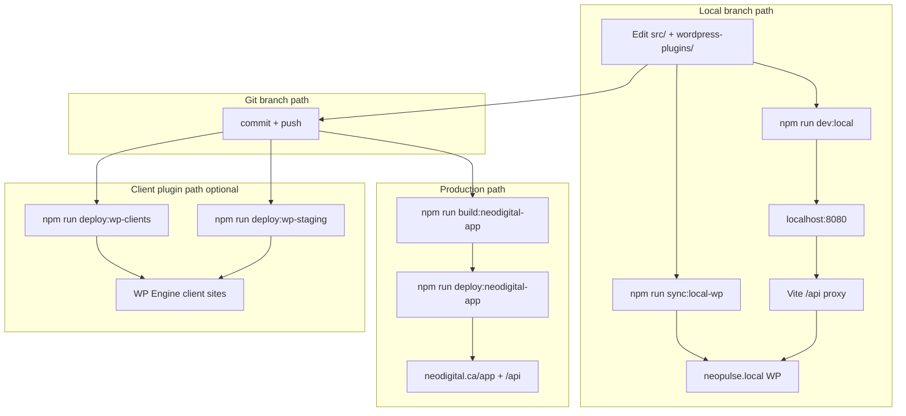

# Deploy branching pathway (local → Git → neodigital.ca)

This runbook describes how **Flowbie One / NEO Pulse** moves from offline local work on **WP Staging Desktop** to production on **neodigital.ca**, and when to use each deploy track.

Use it as the map. Detail lives in:

- [local-wp-staging-dev.md](local-wp-staging-dev.md) — machine setup, plugins, Vite, troubleshooting
- [deploy-neo-pulse.md](deploy-neo-pulse.md) — SFTP production deploy, smoke tests, WP Engine in-app deploy

---

## Three surfaces, one repo

| Surface | URL | Purpose |
|---------|-----|---------|
| **Local UI** | `http://localhost:8080` | React dev (Vite HMR, sub-second saves) |
| **Local API + WP** | `https://neopulse.local` | WordPress + `neo-pulse-app` + `neo-pulse-wp` (offline) |
| **Production** | `https://neodigital.ca/app/` + `/api/*` | Live product |

Client WordPress sites (WP Engine) are a **fourth track**: deploy `neo-pulse-wp` only via SFTP or in-app WP Engine tooling. That does not replace the neodigital.ca app deploy.

---

## Branching model



**Rule:** Local proves behavior. Git records intent. Deploy commands ship artifacts. Never deploy uncommitted work.

---

## Path A — Local offline (default for feature work)

### When to use

- UI changes in `src/`
- API changes in `wordpress-plugins/neo-pulse-app/`
- Client plugin changes in `wordpress-plugins/neo-pulse-wp/` before client SFTP
- Anything that should not touch live neodigital data

### One-time setup

From repo root:

```powershell
npm run setup:local-wp
```

Then in **https://neopulse.local/wp-admin/** activate **NEO Pulse WP** and **NEO Pulse App**.

If plugins do not appear inside Docker (junction on disk but empty in container), copy into the running stack:

```powershell
docker exec -u root wpstg-neopulse-local-php rm -rf /var/www/wp-content/plugins/neo-pulse-wp /var/www/wp-content/plugins/neo-pulse-app
docker cp "B:\Flowbie One\wordpress-plugins\neo-pulse-wp" wpstg-neopulse-local-php:/var/www/wp-content/plugins/neo-pulse-wp
docker cp "B:\Flowbie One\wordpress-plugins\neo-pulse-app" wpstg-neopulse-local-php:/var/www/wp-content/plugins/neo-pulse-app
docker exec -u root wpstg-neopulse-local-php chown -R www-data:www-data /var/www/wp-content/plugins/neo-pulse-wp /var/www/wp-content/plugins/neo-pulse-app
```

Adjust the `B:\Flowbie One` path if your clone lives elsewhere.

### Daily loop

```powershell
npm run dev:local
```

Open **http://localhost:8080**. Do **not** use the WP Admin **NEO Pulse App** menu for the UI locally; it embeds `https://neopulse.local/neo-pulse/`, which has no built SPA. The dev UI is always Vite on port 8080.

| You changed | Action | Reload |
|-------------|--------|--------|
| `src/**` | Save file | Vite HMR (~1s) |
| `wordpress-plugins/neo-pulse-app/**` | Save (junction) or re-`docker cp` | Refresh browser |
| `wordpress-plugins/neo-pulse-wp/**` | Same | Refresh browser |
| Repo root `.env` | `npm run sync:local-wp` | Refresh browser |

### Local login

App auth uses the **neo-pulse-app** user table on local WP, not WP Admin credentials.

After setup, sign in at **http://localhost:8080/login** with the local API user (for example `pulse@neodigital.ca` if that row exists in `wp_neo-pulse_users`). If login fails after a password reset, clear **Local Storage** key `neo-pulse_device_auth` for `localhost:8080`.

First-time empty DB bootstrap (when setup is allowed):

```powershell
curl.exe -k -X POST "https://neopulse.local/api/auth/setup-admin" `
  -H "Content-Type: application/json" `
  -d "@setup-admin.json"
```

`setup-admin.json` body fields: `email`, `password`, `displayName`, `teamName` (not `agencyName`).

### What local does **not** do

- Does not build or serve `dist/` at `/neo-pulse/` on local WP
- Does not sync production database or uploads from neodigital.ca
- Does not deploy to clients or production

---

## Path B — Live API dev (optional)

```powershell
npm run dev
```

Vite proxies `/api` to **https://neodigital.ca**. Use when you only change React and need live production API data.

Do **not** use this path to validate PHP or offline API changes.

---

## Path C — Production (neodigital.ca)

### When to use

Local work is tested and you are ready to ship the headless app (SPA + `neo-pulse-app` plugin).

### Prerequisites

- `wordpress-plugins/flowbie-wpengine.config.json` or `neo-pulse-wpengine.config.json` with SFTP credentials (not committed)
- Git hooks: `git config core.hooksPath .githooks`

### Git step (required before deploy)

```powershell
git status
git add src/ wordpress-plugins/neo-pulse-app/ wordpress-plugins/neo-pulse-wp/ docs/ scripts/ package.json package-lock.json
git reset -- wordpress-plugins/.deploy/*.zip wordpress-plugins/*.zip
git commit -m "Deploy: short summary of what is shipping"
git push origin main
```

Never commit: `.env`, `*-secrets.php`, SFTP CSV, deploy zips.

### Deploy commands

| Change type | Command |
|-------------|---------|
| React + PHP (typical) | `npm run deploy:neodigital-app` |
| React only | `npm run build:neodigital-app` then dist-only flow in [deploy-neo-pulse.md](deploy-neo-pulse.md) |
| PHP plugin only | Plugin-only flow in [deploy-neo-pulse.md](deploy-neo-pulse.md) (still needs a current `dist/` on disk for the main deploy script) |

Full pipeline:

```powershell
npm run deploy:neodigital-app
npm run smoke:neo-pulse
```

### What ships

| Artifact | Local source | Remote (neodigital.ca) |
|----------|--------------|-------------------------|
| React SPA | `dist/` (built with `VITE_BASE_PATH=/app/`) | `./app/` |
| API plugin | `wordpress-plugins/neo-pulse-app/` | `./wp-content/plugins/neo-pulse-app/` |
| Staged client plugin (in-app deploy) | `wordpress-plugins/neo-pulse-wp/` | `./wp-content/uploads/neo-pulse-data/wpengine/plugin/neo-pulse-wp/` |

Production secrets stay on the server (`neo-pulse-app-secrets.php`, wp-config). Deploy scripts do not upload repo `.env` or local `neo-pulse-app-secrets.php`.

### Verify

```powershell
curl.exe -s "https://neodigital.ca/app/build-info.json"
npm run smoke:neo-pulse
```

Open the cache-bust URL from deploy output: `https://neodigital.ca/app/?v=...`

---

## Path D — Client sites (`neo-pulse-wp` only)

Separate from the neodigital.ca app. Use after the plugin change works on local WP.

| Target | Command |
|--------|---------|
| WP Engine **1stg** rows in Customer CSV | `npm run deploy:wp-staging` |
| Production client sites (interactive) | `npm run deploy:wp-clients` |
| In-app batch from neodigital UI | `npm run sync:wpengine-catalog` then Dashboard → WP Engine |

Requires `wordpress-plugins/Customer List/SFTP Users_Clients List.csv` and `npm run embed:neo-pulse-wp-secrets` (runs inside deploy scripts).

---

## Decision matrix

| Goal | Path | Command |
|------|------|---------|
| Build a feature offline | A | `npm run dev:local` |
| Quick UI tweak against live data | B | `npm run dev` |
| Ship app to neodigital.ca | C | `npm run deploy:neodigital-app` |
| Ship plugin to one client | D | `npm run deploy:wp-clients` |
| Ship plugin to all 1stg staging hosts | D | `npm run deploy:wp-staging` |
| Refresh local plugins after `.env` change | A | `npm run sync:local-wp` |
| Fix local hosts / junctions | A | `npm run setup:local-wp` |

---

## End-to-end example (one feature)

1. **Branch (optional):** `git checkout -b feature/my-change`
2. **Local:** `npm run dev:local` → implement in `src/` and/or plugins → verify on `localhost:8080`
3. **Commit:** `git add …` → `git commit` → `git push`
4. **Production:** `npm run deploy:neodigital-app` → `npm run smoke:neo-pulse`
5. **Clients (if plugin changed):** `npm run deploy:wp-staging` on 1stg first, then `deploy:wp-clients` when approved

Typical timing: local iteration seconds to minutes; production deploy minutes (build + SFTP); client SFTP batches vary by site count.

---

## npm script reference (branching-related)

| Script | Path |
|--------|------|
| `setup:local-wp` | A — one-time local stack |
| `sync:local-wp` | A — plugins + secrets |
| `dev:local` | A — Vite + `/api` → neopulse.local |
| `dev` | B — Vite + `/api` → neodigital.ca |
| `embed:neo-pulse-wp-secrets` | A, D — writes `neo-pulse-wp/.env` from repo `.env` |
| `generate:local-app-secrets` | A — writes local `neo-pulse-app-secrets.php` |
| `build:neodigital-app` | C — production SPA build |
| `deploy:neodigital-app` | C — build + SFTP to neodigital.ca |
| `deploy:wp-staging` | D — client plugin to 1stg |
| `deploy:wp-clients` | D — client plugin to production CSV rows |
| `sync:wpengine-catalog` | D — SFTP catalog for in-app deploy |
| `smoke:neo-pulse` | C — post-deploy live checks |

---

## Config files (by path)

| File | Path | Committed |
|------|------|-----------|
| `scripts/local-wp-staging.config.json` | A | No (copy from `.example.json`) |
| Repo `.env` | A, D | No |
| `wordpress-plugins/neo-pulse-wp/.env` | A, D | No (generated) |
| `wordpress-plugins/neo-pulse-app/includes/neo-pulse-app-secrets.php` | A | No (generated) |
| `wordpress-plugins/flowbie-wpengine.config.json` | C, D | No |
| `vite.config.ts` | A, B | Yes (`VITE_LOCAL_API_TARGET` for proxy) |

---

## Troubleshooting (branching)

| Symptom | Likely path | Fix |
|---------|-------------|-----|
| Blank page / `127.0.0.1:3001` errors | A | Use `npm run dev:local`, not `dev` |
| Login "Something went wrong" | A | Hard refresh; clear `neo-pulse_device_auth`; confirm `dev:local` |
| WP Admin NEO Pulse App shows 404 | A | Expected; use `localhost:8080` |
| HTTPS red in WP Staging Desktop | A | Fix hosts to `127.3.2.1 neopulse.local`; test in browser |
| Plugins missing in container | A | `docker cp` block above |
| Deploy rejected / secrets in commit | C | `npm run check:no-secrets`; unstage zips and `.env` |
| Live `/api` 404 after deploy | C | Reactivate plugin in WP admin; flush permalinks |

More detail: [local-wp-staging-dev.md](local-wp-staging-dev.md), [deploy-neo-pulse.md](deploy-neo-pulse.md).

---

## Related implementation files

- [`scripts/setup-local-wp.ps1`](../scripts/setup-local-wp.ps1)
- [`scripts/sync-local-wp-plugins.ps1`](../scripts/sync-local-wp-plugins.ps1)
- [`scripts/dev-local.cjs`](../scripts/dev-local.cjs)
- [`scripts/generate-local-app-secrets.mjs`](../scripts/generate-local-app-secrets.mjs)
- [`scripts/fix-wp-staging-hosts.ps1`](../scripts/fix-wp-staging-hosts.ps1)
- [`wordpress-plugins/deploy-neo-pulse-app.js`](../wordpress-plugins/deploy-neo-pulse-app.js)
- [`src/lib/wordpress-api/connection.ts`](../src/lib/wordpress-api/connection.ts) — API base resolution
- [`vite.config.ts`](../vite.config.ts) — local proxy when `VITE_LOCAL_API_TARGET` is set
