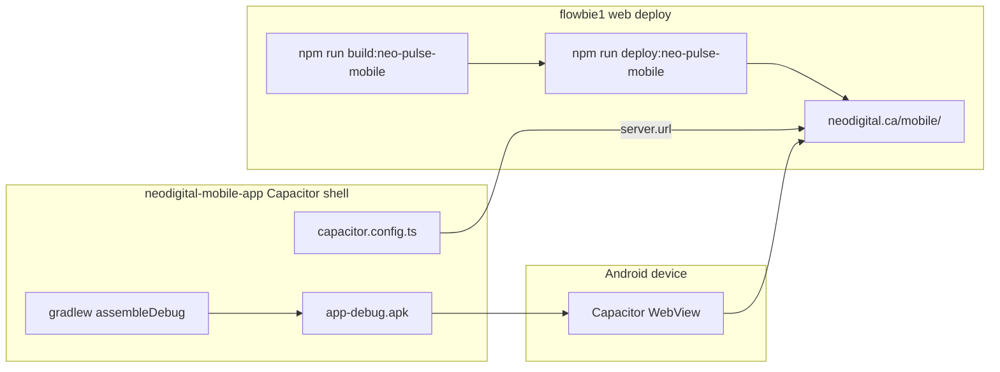

# NEO Pulse Mobile APK Build Guide

Wrap **https://neodigital.ca/mobile/** in a Capacitor Android shell so staff get a sideloadable app. The shell loads the live `/mobile` web app in a WebView — web updates deploy without rebuilding the APK.

This guide follows the **remote WebView shell** pattern used by Fit Claw (`B:\Life One\fit-claw-app`). It is **not** the bundled `npm run apk:debug` flow already in the flowbie1 monorepo root.

---

## Architecture



**How it works:**

1. The flowbie1 monorepo builds and deploys the React mobile UI to `https://neodigital.ca/mobile/`.
2. A separate `neodigital-mobile-app` project holds only the Capacitor shell (config, icons, native plugins).
3. On launch, the APK opens a WebView pointed at the live URL — same idea as Fit Claw loading `https://lifeoneai.com/fit-claw`.
4. Most UI/API changes ship via web deploy; reopen the app to pick them up.

---

## Reference: Fit Claw (working example)

Fit Claw splits the WordPress plugin from the Android shell:

| Piece | Location |
|-------|----------|
| WordPress plugin + desk UI | `B:\Life One\fit-claw\` |
| Capacitor Android shell | `B:\Life One\fit-claw-app\` |

Key Fit Claw shell files to copy patterns from:

| File | Purpose |
|------|---------|
| `fit-claw-app/capacitor.config.ts` | Remote `server.url`, `appendUserAgent`, splash/status bar |
| `fit-claw-app/package.json` | Capacitor deps and npm scripts |
| `fit-claw-app/build-apk.bat` | One-command debug APK build |
| `fit-claw-app/www/index.html` | Minimal local boot page (real UI loads remotely) |
| `fit-claw-app/README.md` | Prerequisites and sideload steps |
| `fit-claw-app/SIDELOAD.md` | Post-install verification checklist |

Fit Claw remote config (the pattern to mirror):

```typescript
// fit-claw-app/capacitor.config.ts
server: {
  url: 'https://lifeoneai.com/fit-claw',
  cleartext: false,
},
android: {
  backgroundColor: '#0a0a0a',
  appendUserAgent: ' LifeOneFitClaw/1',
},
```

---

## Remote shell vs bundled `apk:debug`

The flowbie1 monorepo **already has** Capacitor + `android/` at the repo root, but it uses a **bundled** build:

| | Remote shell (this doc) | Bundled (`npm run apk:debug`) |
|--|-------------------------|-------------------------------|
| **Web source** | Live URL at `neodigital.ca/mobile/` | Vite output copied into `dist/` and packaged |
| **Updates** | Instant after `deploy:neo-pulse-mobile` | Requires rebuild + reinstall |
| **Offline** | Requires network | Partial offline (bundled assets) |
| **Project location** | Separate `neodigital-mobile-app/` folder | flowbie1 root `android/` |
| **Capacitor config** | `server.url` points to production | `webDir: "dist"` — no remote URL |
| **Best for** | Fast iteration on `/mobile` UI | Fully offline or Play Store release |

**Existing bundled commands (do not use for this approach):**

```bash
# Bundled — packages dist/ into APK
npm run build:neo-pulse-mobile   # Vite build with VITE_BASE_PATH=/mobile/
npm run apk:debug                # build + cap sync + gradlew assembleDebug
```

Bundled config lives in `capacitor.config.ts` at the flowbie1 root (`webDir: "dist"`, no `server.url`).

**Web deploy (used by both approaches for the live site):**

```bash
npm run build:neo-pulse-mobile
npm run deploy:neo-pulse-mobile   # SFTP → https://neodigital.ca/mobile/
```

Build script: `scripts/build-neo-pulse-mobile.cjs` sets `VITE_BASE_PATH=/mobile/`, `VITE_MOBILE_APP=1`, `VITE_NEO_PULSE=1`.

Deploy script: `scripts/deploy-neo-pulse-mobile.cjs` sets `DEPLOY_SITE=neodigital.ca`, `DEPLOY_MOBILE=1`.

---

## Recommended project layout

Create a **separate folder** inside or beside the flowbie1 repo. Do not reuse the monorepo root `android/` — that belongs to the bundled flow.

```
B:\Flowbie One\neodigital-mobile-app\
├── capacitor.config.ts
├── package.json
├── tsconfig.json
├── build-apk.bat
├── www/
│   └── index.html          # minimal boot page; real UI loads remotely
└── android/                # generated by `npx cap add android`
```

---

## Key config values

Use these when scaffolding `neodigital-mobile-app/`:

| Setting | Value |
|---------|-------|
| `appId` | `ca.neodigital.neopulse.mobile` (or `ca.neodigital.neopulse.shell` if the bundled app ID conflicts on device) |
| `appName` | `NEOPulse` |
| `webDir` | `www` |
| `server.url` | `https://neodigital.ca/mobile/` |
| `server.cleartext` | `false` |
| `android.backgroundColor` | `#000000` |
| `android.appendUserAgent` | ` NEOPulseMobile/1` |
| Capacitor version | **6.x** in `neodigital-mobile-app/` (JDK 17). Root monorepo may use 7.x for bundled builds. Push requires `@capacitor/push-notifications` + APK rebuild. |

Example `capacitor.config.ts`:

```typescript
import type { CapacitorConfig } from '@capacitor/cli';

const config: CapacitorConfig = {
  appId: 'ca.neodigital.neopulse.mobile',
  appName: 'NEOPulse',
  webDir: 'www',
  server: {
    url: 'https://neodigital.ca/mobile/',
    cleartext: false,
  },
  android: {
    backgroundColor: '#000000',
    appendUserAgent: ' NEOPulseMobile/1',
  },
  ios: {
    appendUserAgent: ' NEOPulseMobile/1',
  },
  plugins: {
    SplashScreen: {
      launchShowDuration: 1200,
      launchAutoHide: true,
      backgroundColor: '#000000',
      showSpinner: false,
    },
    StatusBar: {
      style: 'DARK',
      backgroundColor: '#000000',
    },
  },
};

export default config;
```

Example `package.json` scripts (minimal shell — no camera/timer plugins unless needed later):

```json
{
  "name": "neodigital-mobile-app",
  "version": "1.0.0",
  "private": true,
  "description": "NEO Pulse Android shell — loads neodigital.ca/mobile in Capacitor WebView",
  "scripts": {
    "sync": "cap sync android",
    "open:android": "cap open android",
    "build:android": "cap sync android && cd android && gradlew.bat assembleDebug",
    "assets:generate": "capacitor-assets generate --android"
  },
  "dependencies": {
    "@capacitor/android": "^6.2.0",
    "@capacitor/app": "^6.0.2",
    "@capacitor/core": "^6.2.0",
    "@capacitor/splash-screen": "^6.0.3",
    "@capacitor/status-bar": "^6.0.2"
  },
  "devDependencies": {
    "@capacitor/assets": "^3.0.5",
    "@capacitor/cli": "^6.2.0",
    "typescript": "^5.8.2"
  }
}
```

Example minimal `www/index.html` (copied from fit-claw-app pattern):

```html
<!DOCTYPE html>
<html lang="en">
<head>
  <meta charset="UTF-8" />
  <meta name="viewport" content="width=device-width, initial-scale=1, viewport-fit=cover" />
  <meta name="color-scheme" content="dark" />
  <title>NEOPulse</title>
  <style>
    html, body { margin: 0; height: 100%; background: #000; color: #e8e8e8; font-family: system-ui, sans-serif; }
    .boot { display: flex; align-items: center; justify-content: center; height: 100%; font-size: 0.95rem; opacity: 0.7; }
  </style>
</head>
<body>
  <div class="boot">Loading NEOPulse…</div>
</body>
</html>
```

---

## Prerequisites

Same toolchain as fit-claw-app:

| Tool | Version |
|------|---------|
| JDK | 17 (Temurin / Eclipse Adoptium) |
| Android SDK | `ANDROID_HOME` → `%LOCALAPPDATA%\Android\Sdk` |
| Node.js | 18+ |
| Gradle | 8.2.x (via Android project wrapper) |

**One-time env vars (PowerShell):**

```powershell
[System.Environment]::SetEnvironmentVariable("JAVA_HOME", "C:\Program Files\Eclipse Adoptium\jdk-17.0.20.8-hotspot", "User")
[System.Environment]::SetEnvironmentVariable("ANDROID_HOME", "$env:LOCALAPPDATA\Android\Sdk", "User")
```

Add `%JAVA_HOME%\bin` and `%ANDROID_HOME%\platform-tools` to user `Path`. Restart terminal after.

**Accept SDK licenses:**

```powershell
& "$env:LOCALAPPDATA\Android\Sdk\cmdline-tools\latest\bin\sdkmanager.bat" --licenses
```

---

## Build commands

**Primary (Windows batch — mirror `fit-claw-app/build-apk.bat`):**

```bat
build-apk.bat
```

What `build-apk.bat` should do:

```bat
npm install
npx cap sync android
cd android && gradlew.bat assembleDebug
```

**npm equivalent:**

```bash
npm run build:android
```

**Output:**

```
neodigital-mobile-app\android\app\build\outputs\apk\debug\app-debug.apk
```

**Open in Android Studio (optional):**

```bash
npm run open:android
```

**Regenerate icons/splash:**

```bash
npm run assets:generate
```

---

## Deploy vs rebuild matrix

| Change | Action |
|--------|--------|
| Mobile React UI (chat, assist, agents, tasks, automations) | `npm run deploy:neo-pulse-mobile` in flowbie1 — **no APK rebuild** |
| API / backend / WordPress plugin | Deploy backend — **no APK rebuild** |
| App icon, splash screen | Rebuild APK |
| Status bar / splash Capacitor plugin settings | Rebuild APK |
| New native Capacitor plugin (camera, push, etc.) | Rebuild APK |
| Auth / session | Log in once; cookies persist in WebView on reopen |

**Typical workflow:**

1. Edit mobile UI in flowbie1 (`src/components/mobile-app/`, `src/AppMobile.tsx`, etc.).
2. `npm run deploy:neo-pulse-mobile` from flowbie1 root.
3. Force-close and reopen the app on the phone — changes appear immediately.

---

## Sideload checklist

After building `app-debug.apk`:

1. Build: run `build-apk.bat` from `neodigital-mobile-app/`.
2. Copy `android\app\build\outputs\apk\debug\app-debug.apk` to the phone (USB, Drive, email).
3. Enable install from your file app (Settings → Security → Unknown sources).
4. Tap APK → Install → Open.
5. Log in once at neodigital.ca.
6. Verify:
   - [ ] `/mobile` loads (chat, assist, agents, tasks, automations tabs)
   - [ ] Bottom nav and safe-area layout look correct on notched devices
   - [ ] Streaming chat / assist replies work
   - [ ] App reopen skips login (cookie persistence)
   - [ ] Force-close and reopen picks up latest web deploy without reinstall

---

## Future native hooks (optional)

Not required for the initial shell. Add when native behavior is needed — patterns from Fit Claw:

### Client-side native detection

Fit Claw detects Capacitor in desk JS and adds a body class:

```javascript
// fit-claw/assets/front/desk/00-core.js
if (window.Capacitor && window.Capacitor.isNativePlatform && window.Capacitor.isNativePlatform()) {
  document.documentElement.classList.add('fit-claw-native');
  document.body.classList.add('fit-claw-native');
}
```

For NEO Pulse React, check `window.Capacitor?.isNativePlatform()` in `AppMobile.tsx` or a small hook, then apply CSS classes for native-only chrome (hide browser UI, adjust safe areas).

### User-Agent detection

Fit Claw appends a token via `appendUserAgent` and detects it server-side:

```php
// fit-claw/includes/class-desk-page.php
public static function is_native_client(): bool {
  $ua = isset( $_SERVER['HTTP_USER_AGENT'] ) ? (string) $_SERVER['HTTP_USER_AGENT'] : '';
  return $ua !== '' && strpos( $ua, 'LifeOneFitClaw/' ) !== false;
}
```

Use `NEOPulseMobile/1` the same way if you need server-side native styling or to hide WordPress admin bar.

### Hardware back button

Fit Claw uses `@capacitor/app` for Android back → in-app navigation:

```
fit-claw/assets/front/desk/63-native-back.js
```

Wire similarly in the mobile React router when `isNativePlatform()` is true.

### Other plugins

| Plugin | Fit Claw use | NEO Pulse potential |
|--------|--------------|---------------------|
| `@capacitor/camera` | Weight progress photos | Future media upload |
| `@capacitor/push-notifications` | FCM lock-screen alerts | Required for mentions, DMs, tasks (see below) |
| `@capacitor/app` | Hardware back | Navigation |
| `@capacitor/splash-screen` | Launch splash | Already in shell config |
| `@capacitor/status-bar` | Dark status bar | Already in shell config |
| Custom Java plugin | Workout timer notifications | Only if background tasks needed |

---

## Scaffold checklist (future implementation session)

Use this when creating `neodigital-mobile-app/` for the first time:

1. Copy structure from `B:\Life One\fit-claw-app\` (exclude `node_modules/`, `android/app/build/`).
2. Update `capacitor.config.ts` with NEO Pulse values (see table above).
3. Update `package.json` name, description, and scripts.
4. Replace `www/index.html` boot text with "Loading NEOPulse…".
5. Run `npm install`.
6. Run `npx cap add android` (or keep copied `android/` and run `npx cap sync android`).
7. Update `android/app/src/main/res/` icons and splash (or run `npm run assets:generate` with source assets in `assets/`).
8. Edit `build-apk.bat` title strings from "Fit Claw" to "NEOPulse".
9. Run `build-apk.bat` and confirm `app-debug.apk` output.
10. Sideload and run through the verification checklist above.
11. Deploy a trivial web change via `npm run deploy:neo-pulse-mobile` and confirm the installed app picks it up without rebuild.

---

## Out of scope (this doc)

- Play Store release signing (`assembleRelease`, keystore, AAB)
- iOS / TestFlight shell
- Modifying flowbie1 root `capacitor.config.ts` or bundled `android/`
- Building or shipping the APK in CI

---

## Firebase push notifications (Android)

Native phone notifications use **FCM HTTP v1** from the `neo-pulse-app` plugin plus `@capacitor/push-notifications` in this shell. The remote `/mobile` web app registers device tokens after login; server events (mentions, DMs, task assigned, etc.) dispatch through the shared notification action library.

### One-time Firebase setup

1. Create a Firebase project (or reuse an existing one).
2. Add an **Android app** with package name `ca.neodigital.neopulse.mobile`.
3. Download **`google-services.json`** and place it at:
   - `neodigital-mobile-app/android/app/google-services.json`
   - Do **not** commit this file.
4. In Firebase → Project settings → Service accounts, generate a **Firebase Admin SDK** JSON key.
5. On the WordPress server, set the service account JSON via env or `wp-config.php`:
   - `NEO_PULSE_FCM_SERVICE_ACCOUNT` — full JSON string (same pattern as GSC service account)
6. Rebuild the APK (`build-apk.bat`) after adding `google-services.json` — Gradle applies `com.google.gms.google-services` automatically when the file exists.

### Deploy split

| Change | Action |
|--------|--------|
| Mobile web UI, token registration, prefs | `npm run deploy:neo-pulse-mobile` |
| PHP push API + dispatch hooks | Deploy `neo-pulse-app` plugin |
| Capacitor push plugin / manifest / Firebase | Rebuild + sideload APK |

### In-app notification settings

On mobile, tap the **bell icon** in the app header to toggle notification types (mentions, DMs, task assigned, agent finished, etc.). Preferences sync with chat notification toggles where applicable.

### Verification

1. Log in on the phone → confirm `POST /api/push/devices` succeeds (token stored).
2. From another account, @mention the user → lock-screen notification → tap opens Chat.
3. Assign a task → notification opens Tasks tab.
4. Toggle **Mentions** off in bell settings → mention push suppressed.

---

## Quick reference

| Task | Command / path |
|------|----------------|
| Deploy mobile web | `npm run deploy:neo-pulse-mobile` (flowbie1 root) |
| Build debug APK | `build-apk.bat` (neodigital-mobile-app) |
| APK output | `android\app\build\outputs\apk\debug\app-debug.apk` |
| Live URL | https://neodigital.ca/mobile/ |
| Fit Claw reference shell | `B:\Life One\fit-claw-app\` |
| Mobile React source | `B:\Flowbie One\src\components\mobile-app\` |
| Mobile entry | `B:\Flowbie One\mobile.html` → `src/main-mobile.tsx` |
